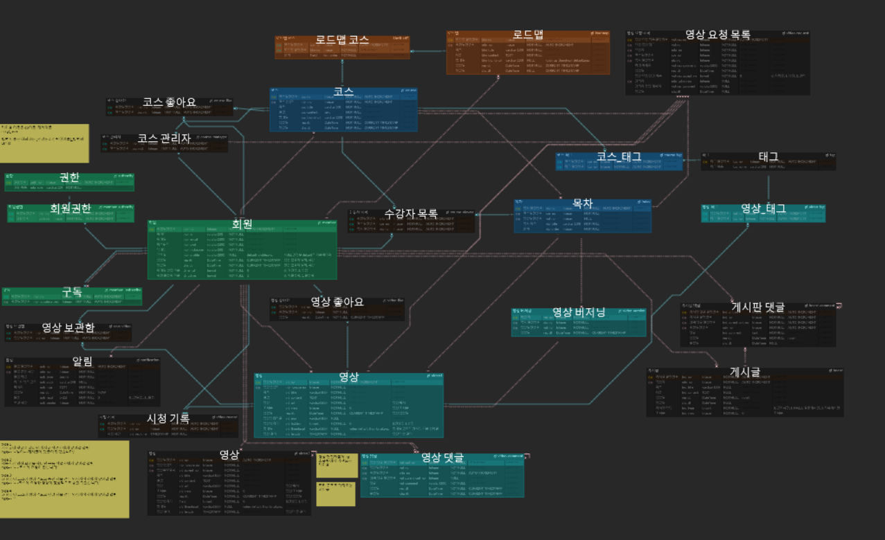

# 고런고런 - Go learn, Go run !

##  🤝공유 강의 플랫폼, 고런고런

누구나 참여할 수 있는 강의 플랫폼, `고런고런`은 누구나 강의제작에 기여하고 강의를 수강하여 **집단지성을 통한 온라인 학습**을 경험할 수 있습니다. 

- **개방성** :  고런고런에 등록되어있는 강의는 누구나, 제약없이 수강가능합니다. 또한 인증이 진행된 사용자라면 누구든지 기존강의에 대한 기여를 통해 더 나은 퀄리티의 강의를 제작할 수 있습니다.

- **집단지성의 사용** : 고런고런은 막 코딩을 시작한 입문자부터 다양한 경험을 통해 숙련된 분까지 강의를 제작할 수 있습니다. 사용자들의 집단지성을 이용해 기존에 존재하는 강의 서비스들보다 더 정확하고 양질의 서비스를 제공할 수 있습니다. 

- **사용자 중심**: 실제 사용자의 입장에서 고민된 기능들이 추가되었습니다. 강의를 편집해서 올리는 어려움을 해결하기 위해 자체 웹 강의 편집기를 제공하며, 동영상을 보며 템플릿 코드를 통해 코딩을 직접해 볼 수 있는 온라인 컴파일러 기능, 강의를 사용자에 맞게 추천해주는 추천기능등 고런고런을 통해 편리함을 느낄 수 있길 기대합니다.

- **모바일 학습**: 고런고런의 베이스가 되는 웹어플리케이션뿐 아니라 안드로이드에서 사용가능한 모바일 플랫폼을 제공합니다.  

  

고런고런의 모든 강의는 **무료**로 제공되며  누구에게나 성장의 기회를 부여합니다. 또한, 언제든지 강의의 제작자가 되어 다른 사용자들에게 자신의 지식을 전달 할 수 있습니다. 이미 생산된 콘텐츠에 대한 참여를 지원 하기 때문에 꼭 전문적인 지식을 가진 사람이지 않더라도 부담없이 활동할 수 있습니다.

[여기](https://golearn.co.kr/)를 클릭하시면 고런고런에 접속하실 수 있습니다. 많은 활동 부탁드립니다 :)

 

### 개발 동기

> 고런고런은 "강의는 왜 다 함께 제작하지 않는걸까?" 라는 의문과 함께 오픈소스에서 영감을 받아 출발하였습니다. 기존 강의서비스들은 이용시 높은 비용을 사용자가 부담해야 하며 강의 제작자 혼자 관리를 하다보니 강의의 퀄리티와 유지보수에 대한 문제가 발생합니다.  
>
> 다양한 사람들에 의해 제작되는 강의가 있다면 이러한 문제를 해결할 수 있다고 생각하였고 이런 아이디어와 구체적인 기능들을 구상하여 `고런고런` 프로젝트를 기획하였습니다.
>
> 초,중,고 교육과정에도 소프트웨어가 기초교육으로 편성되어  갈수록 중요성이 대두되는 코딩이 고런고런으로 하여금 더욱더 접근성이 높아지길 기대합니다.

 

## 💷 ERD
> 아래 이미지를 클릭하면 ERD가 공유된 사이트로 이동됩니다..

